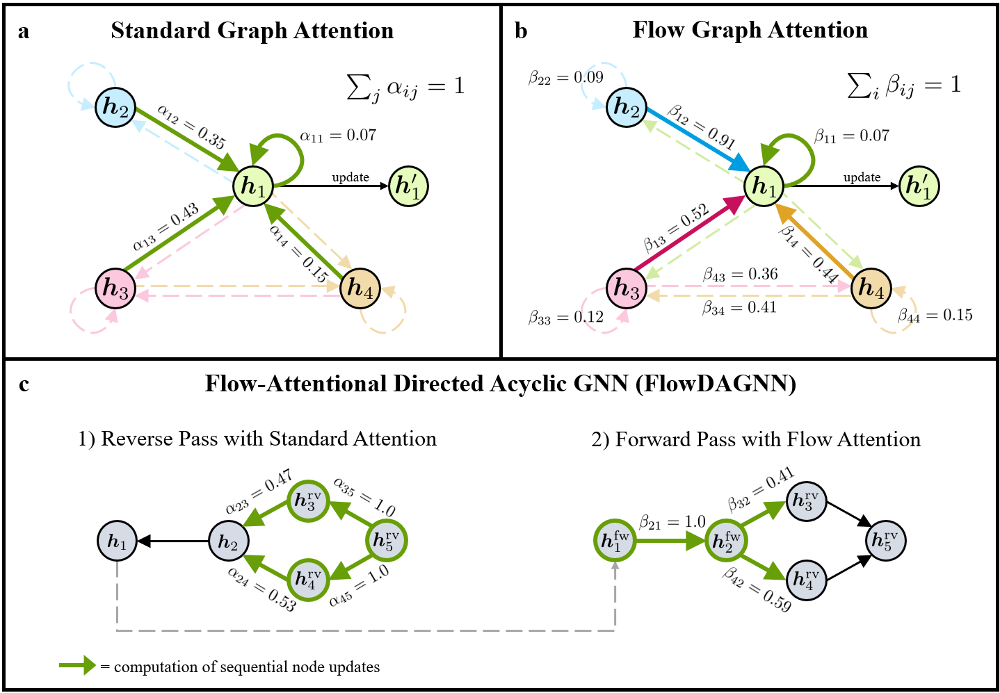

.. These are examples of badges you might want to add to your README:
   please update the URLs accordingly

    .. image:: https://api.cirrus-ci.com/github/<USER>/tennpot.svg?branch=main
        :alt: Built Status
        :target: https://cirrus-ci.com/github/<USER>/tennpot
    .. image:: https://readthedocs.org/projects/tennpot/badge/?version=latest
        :alt: ReadTheDocs
        :target: https://tennpot.readthedocs.io/en/stable/
    .. image:: https://img.shields.io/coveralls/github/<USER>/tennpot/main.svg
        :alt: Coveralls
        :target: https://coveralls.io/r/<USER>/tennpot
    .. image:: https://img.shields.io/pypi/v/tennpot.svg
        :alt: PyPI-Server
        :target: https://pypi.org/project/tennpot/
    .. image:: https://img.shields.io/conda/vn/conda-forge/tennpot.svg
        :alt: Conda-Forge
        :target: https://anaconda.org/conda-forge/tennpot
    .. image:: https://pepy.tech/badge/tennpot/month
        :alt: Monthly Downloads
        :target: https://pepy.tech/project/tennpot
    .. image:: https://img.shields.io/twitter/url/http/shields.io.svg?style=social&label=Twitter
        :alt: Twitter
        :target: https://twitter.com/tennpot

.. image:: https://img.shields.io/badge/-PyScaffold-005CA0?logo=pyscaffold
    :alt: Project generated with PyScaffold
    :target: https://pyscaffold.org/

|

=======
FlowGNN
=======

   Official Python code for the paper "Flow Graph Neural Networks" submitted to ICLR 2024:
   https://openreview.net/forum?id=iKI7wT6fCP

This repository is divided into two distinct sections: flowgnn_opamps and flowgnn_powergraph. 

The flowgnn_opamps folder contains the code for the experiments on the CktBench-101 dataset from Dong et al. (2023) (Paper: https://arxiv.org/abs/2308.16406, Code: https://github.com/zehao-dong/CktGNN). 

The flowgnn_powergraph folder contains the code for the experiments on the PowerGraph dataset. Compared to the original PowerGraph-Graph code from Varbella et al. (2024) (Paper: https://arxiv.org/abs/2402.02827, Code: https://github.com/PowerGraph-Datasets/PowerGraph-Graph), we added some more models: GATv2, FlowGAT, FlowGATv2, FlowTransformer (FlowGT).

   

====
Note
====

This project has been set up using PyScaffold 4.5. For details and usage
information on PyScaffold see https://pyscaffold.org/.
